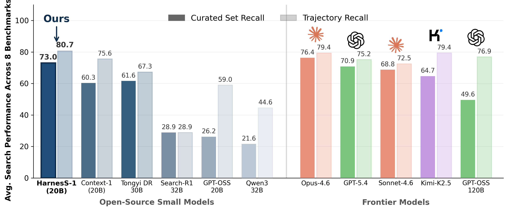

# HarnesS-1

[](https://github.com/pat-jj/harness-1/blob/main/inference/tinker_inference.md)
[](https://huggingface.co/pat-jj/harness-1)
[](https://arxiv.org/)

HarnesS-1 is a stateful search harness for training and evaluating retrieval
agents. It combines a GPT-OSS policy with explicit working memory, evidence
tracking, document curation, verification, and token-budget controls so the
model can run long multi-turn search trajectories over large corpora.



## Checkpoint

The released HarnesS-1 checkpoint is available on Hugging Face:
[pat-jj/harness-1](https://huggingface.co/pat-jj/harness-1).

Set the model repository once and reuse it across inference and export scripts:

```bash
HARNESS1_HF_MODEL=pat-jj/harness-1
```

## Repository Layout

- `training/`: SFT data generation, SFT training, RL training, and launch scripts.
- `inference/`: Harness-1 evaluation, component ablations, HF inference, and vLLM inference.
- `inference/baselines/`: in-domain and transfer baseline evaluation runners.
- `harness/`: shared harness, tool, trajectory, task, reranking, and config modules.
- `model_export/`: helper scripts for merging a private Tinker adapter into a Hugging Face model.
- `datagen/` and `eval_scripts/`: dataset and auxiliary evaluation code.
- `tinker-cookbook/`: local Tinker cookbook dependency used by the training scripts.
- `tests/`: lightweight import and CLI smoke tests.

## Dataset Availability

The public, ready-to-run evaluation path in this repository is
BrowseComp+ (`browsecompplus`). It uses the public BrowseComp+ release plus the
local qrel/query files described in `datagen/README.md`.

The other in-domain corpora used in the paper (`web`, `sec`, and `patents`) are
not packaged here as public ready-made indexes. To evaluate those settings, first
construct the corresponding corpora and Chroma collections by following the
Context-1 data-generation pipeline:
[chroma-core/context-1-data-gen](https://github.com/chroma-core/context-1-data-gen).
After those corpora are available in your Chroma deployment, the evaluation
entrypoints in `inference/` can target them.

## Setup

Use Python 3.11+ and install dependencies with `uv`:

```bash
uv sync
```

For local vLLM serving, install the optional extra:

```bash
uv sync --extra vllm
```

Create a local environment file from the template:

```bash
cp .env.example .env.local
```

Fill only the credentials needed for the workflow you plan to run. `.env.local`
is ignored by git; do not commit real keys or tokens.

Common requirements:

- Training and Tinker-hosted evaluation: `TINKER_API_KEY`.
- Corpus retrieval and embeddings: Chroma/OpenAI configuration.
- Reranking: `BASETEN_API_KEY`.
- Hugging Face upload: a write-capable Hugging Face token exported in your shell.

## Smoke Tests

These tests validate imports and command-line wiring without launching a full
training or evaluation run:

```bash
uv run python tests/smoke_imports.py
uv run python tests/smoke_cli.py
```

## Inference

Run a basic Hugging Face model-load test after the merged model has been
uploaded:

```bash
uv run python inference/hf_inference.py \
  --model ${HARNESS1_HF_MODEL:-harness-1} \
  --prompt "Briefly describe HarnesS-1."
```

For local vLLM serving:

```bash
uv sync --extra vllm
uv run python inference/vllm_local_inference.py serve \
  --model ${HARNESS1_HF_MODEL:-harness-1} \
  --served-model-name harness-1
```

## Training Pipeline

1. Generate SFT trajectories in `training/`.
2. Train the SFT checkpoint in `training/`.
3. Launch RL from the user-trained SFT checkpoint with `training/launch_rl.sh`.

Start with the folder README:

```bash
less training/README.md
```

## Evaluation

Evaluate HarnesS-1 search behavior with:

```bash
PYTHONPATH=. uv run python inference/evaluate_harness1.py --help
```

Transfer evaluation, ablations, and baseline runners are documented in
`inference/README.md`. The default HarnesS-1 search operating point is
temperature `1.0`.

## Model Export

`model_export/` contains utilities for downloading a Tinker checkpoint adapter,
merging it into the base GPT-OSS model, and uploading the resulting full model
to Hugging Face. See `model_export/README.md`.
